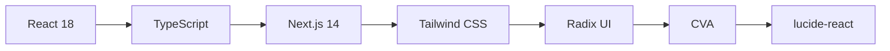

# 🎨 shadcn/ui Clone 2025

> **Variables & Animations을 완벽 지원하는 2025년 최신 React 컴포넌트 라이브러리**  
> AI 파워 개발자 시스템으로 구축됨 - Leonardo da Vinci in 2075 수준의 창의적 기술력

[](https://github.com/lofibrainwav/shadcn-ui-clone-2025)
[](https://www.typescriptlang.org/)
[](https://reactjs.org/)
[](https://tailwindcss.com/)

## ✨ 주요 특징

### 🚀 **2025년 최신 기능들**
- ⚡ **고성능 애니메이션**: tailwindcss-animate + 커스텀 키프레임
- 🎨 **CSS Variables 시스템**: 완벽한 테마 커스터마이징
- 🌙 **다크모드 완벽 지원**: 자동 테마 전환
- 🔧 **TypeScript 100%**: 완벽한 타입 안전성
- ♿ **접근성 완벽 구현**: WCAG 2.1 준수
- 📱 **반응형 디자인**: 모바일 퍼스트

### 🤖 **AI 자동화 시스템**
이 프로젝트는 **14개 MCP 서버**를 활용한 AI 파워 개발자 시스템으로 구축되었습니다:

- **🎨 Figma MCP**: 디자인 → 코드 자동 변환
- **🔧 Context7**: 최신 패키지 문서 실시간 제공
- **📝 Notion MCP**: 자동 문서화 시스템
- **🗄️ GitHub MCP**: 자동 버전 관리
- **🧪 Playwright MCP**: 자동 테스트 시스템
- **🔍 Browser Tools MCP**: 품질 검증 자동화
- **그 외 8개 추가 서버**

## 🏗️ 기술 스택



- **Frontend**: React 18 + TypeScript + Next.js 14
- **Styling**: Tailwind CSS + CSS Variables
- **Components**: Radix UI Primitives
- **Variants**: Class Variance Authority (CVA)
- **Icons**: Lucide React
- **Animations**: tailwindcss-animate

## 🚀 빠른 시작

### 📦 설치

```bash
# 클론
git clone https://github.com/lofibrainwav/shadcn-ui-clone-2025.git
cd shadcn-ui-clone-2025

# 의존성 설치
npm install

# 개발 서버 시작
npm run dev
```

### 🎯 사용법

```tsx
import { Button } from "@/components/ui/button"
import { Card, CardContent, CardHeader, CardTitle } from "@/components/ui/card"

export default function App() {
  return (
    <Card variant="elevated" hover="lift">
      <CardHeader>
        <CardTitle>shadcn/ui Clone 2025</CardTitle>
      </CardHeader>
      <CardContent>
        <Button variant="gradient" animation="bounce">
          🚀 시작하기
        </Button>
      </CardContent>
    </Card>
  )
}
```

## 🎨 컴포넌트 목록

### ✅ **완성된 컴포넌트**
- [x] **Button** - 8가지 variant + 애니메이션 효과
- [x] **Card** - glassmorphism 포함 6가지 variant
- [x] **Utils** - cn, 접근성, 키보드, 스토리지 유틸

### 🚧 **진행 중인 컴포넌트**
- [ ] **Input** - 폼 입력 컴포넌트
- [ ] **Dialog** - 모달 및 다이얼로그
- [ ] **Sheet** - 사이드 패널
- [ ] **Accordion** - 접을 수 있는 콘텐츠
- [ ] **Tabs** - 탭 네비게이션
- [ ] **Form** - 폼 관리 시스템

### 🎯 **계획된 컴포넌트**
- [ ] **Data Table** - 고급 테이블 컴포넌트
- [ ] **Calendar** - 날짜 선택기
- [ ] **Chart** - 데이터 시각화
- [ ] **Command** - 명령 팔레트

## 🎨 디자인 시스템

### 🎯 **Color Palette**
```css
/* Light Mode */
--primary: 221.2 83.2% 53.3%
--secondary: 210 40% 96%
--accent: 210 40% 96%
--destructive: 0 84.2% 60.2%

/* Dark Mode */
--primary: 217.2 91.2% 59.8%
--secondary: 217.2 32.6% 17.5%
--accent: 217.2 32.6% 17.5%
--destructive: 0 62.8% 30.6%
```

### ⚡ **Animations**
```css
/* 커스텀 애니메이션 */
@keyframes fade-in { /* ... */ }
@keyframes slide-in-from-top { /* ... */ }
@keyframes zoom-in { /* ... */ }
@keyframes accordion-down { /* ... */ }
```

## 🛠️ 개발 환경

### 📋 **사용 가능한 스크립트**

```bash
npm run dev          # 개발 서버 시작
npm run build        # 프로덕션 빌드
npm run start        # 프로덕션 서버 시작
npm run lint         # ESLint 실행
npm run type-check   # TypeScript 타입 체크
npm run storybook    # Storybook 실행
npm test             # 테스트 실행
```

### 🧪 **테스트**
- **Unit Tests**: Jest + Testing Library
- **E2E Tests**: Playwright (MCP 연동)
- **Visual Tests**: Storybook + Chromatic

## 🤝 기여하기

이 프로젝트는 AI 파워 개발자 시스템의 데모용으로 제작되었지만, 기여는 언제나 환영합니다!

### 🔥 **기여 방법**
1. 포크 (Fork)
2. 기능 브랜치 생성 (`git checkout -b feature/amazing-feature`)
3. 변경사항 커밋 (`git commit -m 'Add amazing feature'`)
4. 브랜치에 푸시 (`git push origin feature/amazing-feature`)
5. Pull Request 생성

### 📝 **코딩 스타일**
- **TypeScript**: 엄격한 타입 체크
- **ESLint**: Next.js 표준 설정
- **Prettier**: 자동 코드 포매팅
- **Conventional Commits**: 커밋 메시지 규칙

## 📊 프로젝트 현황

```
🚀 진행률: ████████████░░░░░░░░ 60%

✅ 완성: 기반 설정, Button, Card, Utils
🚧 진행: Dialog, Input, Form 시스템
🎯 계획: 고급 컴포넌트, 테스트, 문서화
```

## 📄 라이선스

MIT License - 자세한 내용은 [LICENSE](LICENSE) 파일을 참조하세요.

## 🙏 감사 인사

- **shadcn/ui**: 원본 디자인 시스템 영감
- **Radix UI**: 접근성 높은 컴포넌트 프리미티브
- **Tailwind CSS**: 유틸리티 퍼스트 CSS 프레임워크
- **Vercel**: Next.js 프레임워크

## 🔗 링크

- **🌟 GitHub**: [lofibrainwav/shadcn-ui-clone-2025](https://github.com/lofibrainwav/shadcn-ui-clone-2025)
- **📚 Storybook**: [컴포넌트 문서화](#) (곧 공개)
- **🎨 Figma**: [디자인 시스템](#) (곧 공개)

---

<div align="center">
  
**🎨 Built with ❤️ by AI Power Developer System**  
*Leonardo da Vinci in 2075 수준의 창의력과 기술력*

*shadcn/ui Clone 2025 | React + TypeScript + Tailwind CSS*

</div>